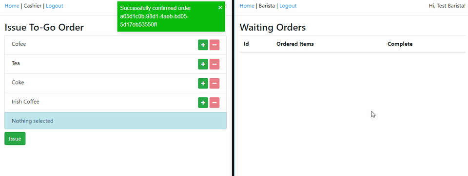
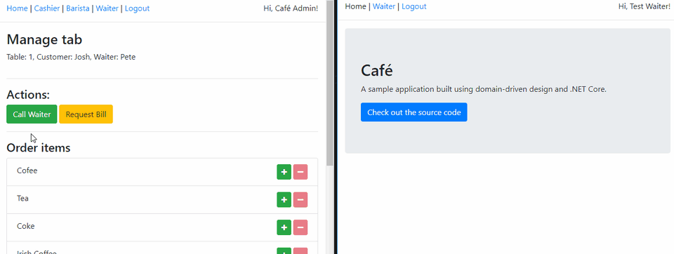

[](https://travis-ci.org/dnikolovv/cafe) [](https://codecov.io/gh/dnikolovv/cafe)


> Café is an example application demonstrating a combination between domain-driven design and functional programming. It is continuously deployed to https://cafeapi.devadventures.net/openapi and https://cafe.devadventures.net.

## Features

1. DDD done by the book
2. REST with [HATEOAS](https://en.wikipedia.org/wiki/HATEOAS)
3. CQRS
4. Functional style command/query handlers
5. Event-sourcing
6. A complete integration tests suite (~100% coverage) + coverage reports
7. Docker CI setup with multiple data sources + CD on Azure
8. Real-time communications through SignalR

As a whole, this projects aims to stand out from the other examples by being as complete as possible code/structure wise. It should serve as an example of how a real enterprise project built using these principles would look like.

## What to note

### 1. Demonstrated DDD concepts

#### Bounded contexts

- AuthContext
- BaristaContext
- CashierContext
- ManagerContext
- MenuContext
- OrderContext
- TabContext
- TableContext
- WaiterContext

See [`Cafe.Business`](https://github.com/dnikolovv/cafe/tree/master/server/src/server/Cafe.Business) or [`Cafe.Core`](https://github.com/dnikolovv/cafe/tree/master/server/src/server/Cafe.Core) for a more in-depth look.

#### Ubiqutous language

> **Menu** - The café menu. Contains Menu Items that can be ordered either for a Tab or for a To-go Order.
>
> **Menu Item** - An item from the menu, identified by a number.
>
> **Tab** - An open bill on a table.
>
> **To-go order/Order** - An order that is not linked to a particular table. Customers make these orders by going >to the Cashier. When they get paid, the Cashier will issue them to the Barista for completion.
>
> **Customer** - A person that opened a tab/made an order.
>
> **Table** - Represents a physical table in the café. Tables are assigned to Waiters who are responsible for >managing the tab.
>
> **Manager** - The café manager. Manages the menu items. Manages the tables. Hires Waiters/Cashiers/Baristas. >Assigns waiters to tables.
>
> **Cashier** - Takes to-go orders.
>
> **Barista** - Waits for confirmed to-go orders to complete them.
>
> **Waiter** - Serves a fixed set of tables, takes orders and delivers/rejects menu items.
>
> **User/Account** - An account with which you can login into the web portal. On its own, the account can do nothing, it must be assigned to some employee by the Admin. (e.g. you can link an account to a waiter)
>
> **Admin** - The web portal administrator. Manages the links between the accounts and the employees. Has rights to do pretty much everything.

#### Event-sourcing

The [`Tab`](https://github.com/dnikolovv/cafe/blob/master/server/src/server/Cafe.Domain/Entities/Tab.cs) is an event-sourced aggregate that is constructed by the various [domain events](https://github.com/dnikolovv/cafe/tree/master/server/src/server/Cafe.Domain/Events) that are published by the command handlers using the [EventBus](https://github.com/dnikolovv/cafe/blob/master/server/src/server/Cafe.Business/_Base/EventBus.cs).

#### Shared kernel

For when you need to share data between contexts, use the shared kernel.

See [`Cafe.Core`](https://github.com/dnikolovv/cafe/tree/master/server/src/server/Cafe.Core/_Kernel) and [`Cafe.Business`](https://github.com/dnikolovv/cafe/tree/master/server/src/server/Cafe.Business/_Kernel)

#### And probably a bit more if you care enough to look for them :)

### 2. Functional style command/query handlers

Each handler is implemented as a chain of functions (using [`Optional.Async`](https://github.com/dnikolovv/optional-async)). Each function represents an operation that can either pass (continue the execution) or fail (return an `Error` to the consumer).

Examples:

```csharp
// OpenTabHandler.cs
public override Task<Option<Unit, Error>> Handle(OpenTab command) =>
    TabShouldNotExist(command.Id).FlatMapAsync(tab =>
    TableShouldNotBeTaken(command.TableNumber).FlatMapAsync(tableNumber =>
    TheTableShouldHaveAWaiterAssigned(tableNumber).MapAsync(waiter =>
    PublishEvents(tab.Id, tab.OpenTab(command.CustomerName, waiter.ShortName, command.TableNumber)))));

// OrderMenuItemsHandler.cs
public override Task<Option<Unit, Error>> Handle(OrderMenuItems command) =>
    TabShouldNotBeClosed(command.TabId).FlatMapAsync(tab =>
    MenuItemsShouldExist(command.ItemNumbers).MapAsync(items =>
    PublishEvents(command.TabId, tab.OrderMenuItems(items))));

// CallWaiterHandler.cs
public override Task<Option<Unit, Error>> Handle(CallWaiter command) =>
    TableShouldExist(command.TableNumber).FlatMapAsync(table =>
    TableShouldHaveAWaiterAssigned(table).MapAsync(waiter =>
    PublishEvents(table.Id, new WaiterCalled { TableNumber = table.Number, WaiterId = waiter.Id })));
```

> [--> See more handlers <--](https://github.com/dnikolovv/cafe/tree/master/server/src/server/Cafe.Business/TabContext/CommandHandlers)

The command/query validation is handled by `FluentValidation` and happens at the handler level rather than at the API level.

The chain itself contains all of the business validations such as checking whether the tab is closed, checking whether you're not serving beverages that haven't been ordered, etc.

Each handler is in a separate file to avoid the classes getting too big.

### 3. A complete integration tests suite

Most of the functionality is implemented using TDD, therefore the project has nearly 100% tests coverage, most of which are integration tests.

Examples:

```csharp
[Theory]
[CustomizedAutoData]
public async Task CanOpenTab(OpenTab openTabCommand, HireWaiter hireWaiterCommand, AddTable addTableCommand)
{
    // Arrange
    await _helper.SetupWaiterWithTable(hireWaiterCommand, addTableCommand);

    // Make sure we're trying to open a tab on the added table
    openTabCommand.TableNumber = addTableCommand.Number;

    // Act
    var result = await _fixture.SendAsync(openTabCommand);

    // Assert
    await _helper.AssertTabExists(
        openTabCommand.Id,
        t => t.IsOpen == true &&
                t.WaiterName == hireWaiterCommand.ShortName &&
                t.CustomerName == openTabCommand.CustomerName);
}

[Theory]
[CustomizedAutoData]
public async Task CanOpenTabOnARecentlyFreedTable(Guid tabId, int tableNumber)
{
    // Arrange
    await _helper.OpenTabOnTable(tabId, tableNumber);
    await _helper.CloseTab(tabId, 1);

    var commandToTest = new OpenTab
    {
        Id = Guid.NewGuid(),
        CustomerName = "Customer",
        TableNumber = tableNumber
    };

    // Act
    var result = await _fixture.SendAsync(commandToTest);

    // Assert
    await _helper.AssertTabExists(
        commandToTest.Id,
        t => t.IsOpen == true &&
                t.TableNumber == tableNumber);
}

[Theory]
[CustomizedAutoData]
public async Task CanAddMenuItems(MenuItemView[] itemsToAdd)
{
    // Arrange
    var command = new AddMenuItems
    {
        MenuItems = itemsToAdd
    };

    // Act
    var result = await _fixture.SendAsync(command);

    // Assert
    var itemsInDb = await _fixture.ExecuteDbContextAsync(dbContext => dbContext
        .MenuItems
        .ToListAsync());

    itemsInDb.ShouldAllBe(i => itemsToAdd.Any(addedItem =>
        i.Number == addedItem.Number &&
        i.Description == addedItem.Description &&
        i.Price == addedItem.Price));
}

[Theory]
[CustomizedAutoData]
public async Task CannotAddConflictingMenuItemsWhenAllAreConflicting(MenuItemView[] itemsToAdd)
{
    // Arrange
    var command = new AddMenuItems
    {
        MenuItems = itemsToAdd
    };

    await _fixture.SendAsync(command);

    // Act
    var result = await _fixture.SendAsync(command);

    // Assert
    result.ShouldHaveErrorOfType(ErrorType.Conflict);
}
```

You can find out more by taking a look at the [tests assembly](https://github.com/dnikolovv/cafe/tree/master/server/tests/Cafe.Tests).

### 4. Real-time communication using SignalR

Issue orders:



Call waiter/ request bill:



## Getting Started

These instructions will get you a copy of the project up and running on your local machine for development and testing purposes.

### Prerequisites

If you have Docker installed you can just double-click `run-app.sh`.

If not, you'll need to have [PostgreSql](https://www.postgresql.org/download/) either installed locally or at least have some instance available to set up the connection strings.

You'll also need at least version `2.2` of the [`.NET Core SDK`](https://dotnet.microsoft.com/download).

### Running the API

> Note that you can point both the event-store and the relational connection to the same database

#### Using Docker

1. Execute `run-app.sh`. You should have a client running at http://localhost:3000 and api at http://localhost:5000

#### Using Visual Studio

1. Open the `.sln` file using Visual Studio
2. Set up the connection strings inside `Cafe.Api/appsettings.json`
3. Execute `Update-Database` inside the `Package Manager Console`
4. Run the application

#### Using the `dotnet` CLI

1. Open the project folder inside your favorite editor
2. Set up the connection strings inside `Cafe.Api/appsettings.json`
3. Execute `dotnet ef database update` inside the `Cafe.Api` folder
4. Execute `dotnet run`
5. Go to `http://localhost:5000` (or whatever port you're running it on)

### Running the client

#### Using Docker

1. Execute `run-app.sh`. You should have a client running at http://localhost:3000 and api at http://localhost:5000

#### Using npm

1. While in the context of the `./client`/ folder
2. Run `npm i`
3. Run `npm start`

## Running the tests

> Note that you can point both the event-store and the relational connection to the same database

#### Using Docker

1. Simply run `run-integration-tests.sh`.

#### Using Visual Studio or the `dotnet` CLI

1. Set up the connection strings inside `Bar.Tests/appsettings.json` to a valid database. (if you point it to an unexisting one, the app will create it for you)
2. Either run them through the `Test Explorer` in Visual Studio or using `dotnet test`

## Contributing

If you feel like contributing, PRs are welcome!

## License

This project is licensed under the MIT License.
